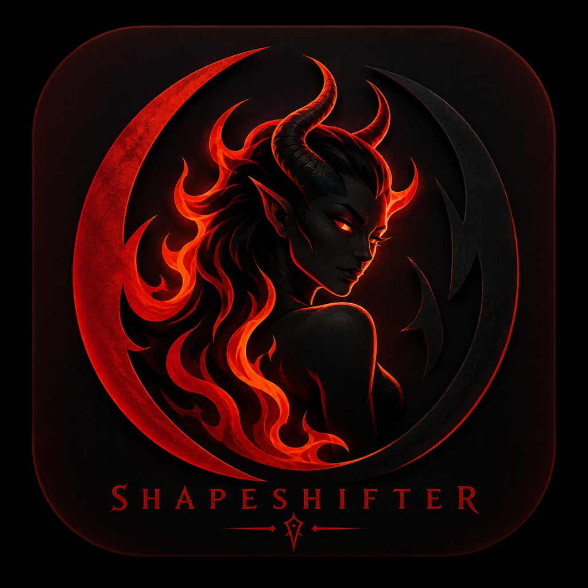

<p align="center">
  
</p>

<h1 align="center">SHAPESHIFTER</h1>

<p align="center">
  <strong>The Ultimate Desktop Environment Store & Profile Manager for Lilith Linux</strong>
</p>

<p align="center">
  <a href="https://github.com/BlancoBAM/Shapeshifter/releases"></a>
  <a href="LICENSE"></a>
  
</p>

---

## Overview

**Shapeshifter** is a native system utility for **Lilith Linux**, built from the ground up with **Rust** and **Slint**. 

Inspired by modern, clean control centers, it consolidates desktop customization into a highly streamlined **2-tab interface** (**DE Store** and **Profiles**), allowing you to swap desktop shells on-the-fly and seamlessly manage custom configurations (dotfiles, themes, wallpapers) between profiles with automatic conflict isolation.

---

## Core Features

### 🌌 1. Desktop Environment Store
Install and remove desktop environments cleanly. Shapeshifter uses lightweight meta-packages (`lilith-*`) to install only the **strictly minimal components** required for each DE, keeping your terminal emulator, file manager, and default system utilities uniform (Hyper Terminal and COSMIC Files are preserved across all configurations).

Supported environments (pre-packaged and integrated):
- **Plasma** (`lilith-plasma`) - Core KDE shell & wayland session.
- **XFCE** (`lilith-xfce`) - Classic, lightweight GTK environment.
- **LXDE** & **LXQt** (`lilith-lxde`, `lilith-lxqt`) - Ultra-minimal systems.
- **Budgie** (`lilith-budgie`) - Modern, simple desktop.
- **Deepin** (`lilith-deepin`) - Elegant, rich experience.
- **Trinity** (`lilith-trinity`) - Classic TDE desktop environment.
- **Enlightenment** (`lilith-enlightenment`) - Fast, advanced stacking window manager.
- **Pantheon** (`lilith-pantheon`) - Clean, desktop-shell experience.
- **GNOME** (`lilith-gnome`) - Minimal modern GNOME shell session.
- **MATE** (`lilith-mate`) - Classic, comfortable desktop.
- **i3** & **Sway** (`lilith-i3`, `lilith-sway`) - Efficient tiling window managers.

---

### 🎨 2. Profile Management
Save and restore visual setups (GTK themes, icons, fonts, wallpapers, and specific desktop panel layouts) under individual profile cards, grouped by desktop environment.
- **Visual Grid**: Thumbnails and instant mouse-hover restore/delete controls.
- **Automatic DE Isolation**: Restoring a profile configures default display preferences, autostart isolation, and active session files.
- **Session Auto-Restore**: Leveraging XDG autostart (`shapeshifter --restore-session`), your saved theme and configuration are automatically applied when logging into a desktop environment.

---

## System Integration

```
                 ┌────────────────────────────────┐
                 │        Shapeshifter GUI        │
                 └───────┬────────────────┬───────┘
                         │                │
             ┌───────────▼──────────┐  ┌──▼───────────────────┐
             │     DE Store Tab     │  │     Profiles Tab     │
             └───────────┬──────────┘  └──────────┬───────────┘
                         │                        │
        ┌────────────────▼────────────────┐  ┌────▼────────────────────────┐
        │ pkexec apt install lilith-<de>  │  │ dotfiles backup / restore   │
        │  (minimal desktop shell only)   │  │   & DE conflict isolation   │
        └─────────────────────────────────┘  └─────────────────────────────┘
```

---

## Configuration & Architecture

### Unified Distro Config (`~/.config/shapeshifter/config.json`)
```json
{
  "version": 2,
  "last_remote_path": "",
  "installed_des": ["cosmic", "plasma"],
  "last_profile": {
    "de": "cosmic",
    "name": "Frosted Obsidian"
  }
}
```

### Auto-Session Restore
When installing the Debian package, a startup helper `shapeshifter-restore.desktop` is registered inside `/etc/xdg/autostart/`. On user login:
```bash
shapeshifter --restore-session
```
This identifies the current environment (via `$XDG_CURRENT_DESKTOP`) and applies your active profile configs silently in the background, isolating startup and appearance variables.

---

## Installation & Build

### Prerequisites
Install compilation and graphics libraries:
```bash
sudo apt update
sudo apt install -y build-essential libfontconfig1-dev libxcb-render0-dev \
    libxcb-shape0-dev libxcb-xfixes0-dev libxkbcommon-dev libssl-dev \
    libgtk-3-dev
```

### Build from Source
```bash
cargo build --release
```

### Build .deb Package
```bash
# Verify the build structure and package
dpkg-deb --build debian/shapeshifter
```

---

## Part of Lilith Linux

Shapeshifter is a fundamental core package of the **Lilith Linux** distribution overlay:

| Core Package | Function |
|--------------|----------|
| **COSMIC Desktop** | Default modern Wayland desktop environment |
| **Shapeshifter** | Universal desktop switcher and profile manager |
| **Tweakers** | Direct system tuner and speed optimizer |
| **Lilim** | Contextual AI assistant with persistent memory |

---

## License

This project is licensed under the MIT License - see the [LICENSE](LICENSE) file for details.
